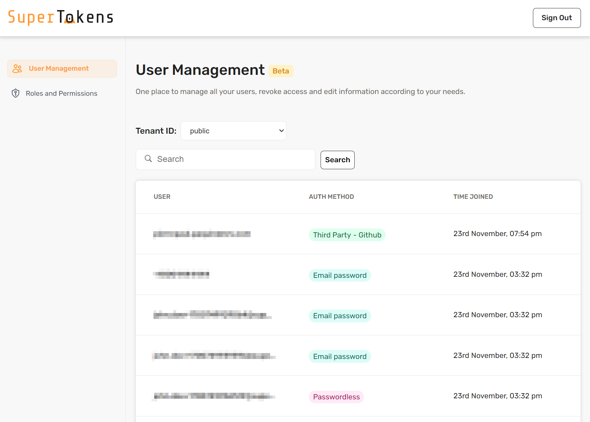

  <h1 align="center">🔒 STExpressKit 🛠️</h1>

### Table of Contents

- [📢 What is STExpressKit?](#-what-is-stexpresskit)
- [⚙️ Usage](#%EF%B8%8F-usage)
- [⭐ Features](#-features)

## 📢 What is STExpressKit?

**STExpressKit** is a starter kit designed to accelerate the setup of authentication in your web applications using Express. It seamlessly integrates SuperTokens, providing powerful security measures for hassle-free and scalable user authentication.

  </img>

## ⚙️ Usage

To start the development environment, follow these steps:

1. Clone the repository
2. Install dependencies with `npm install` or `yarn`
3. Start the server using `npm start` or `yarn start`

Open [http://localhost:3000/auth/dashboard](http://localhost:3000/auth/dashboard) with your browser to see the SuperTokens dashboard 🎢

## ⭐ Features

✅ Express-based setup for quick authentication implementation

✅ Seamless integration of SuperTokens for robust security measures

✅ Scalable architecture for hassle-free user authentication

 

    Made with ❤️ by <b><a href="https://www.linkedin.com/in/jalvarezz13/">jalvarezz13</a></b>
     

